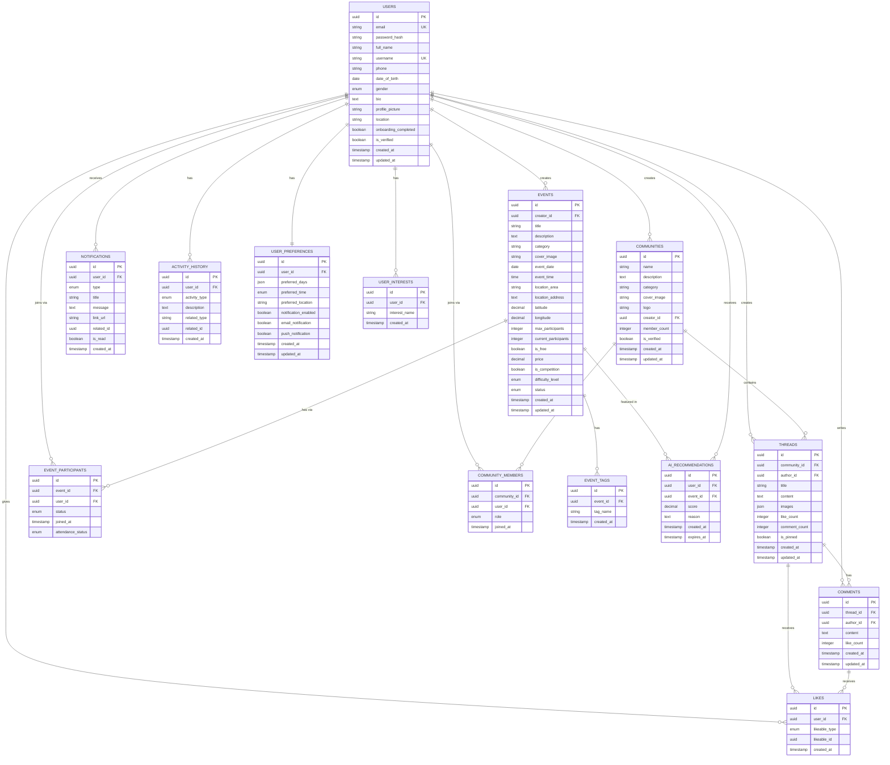
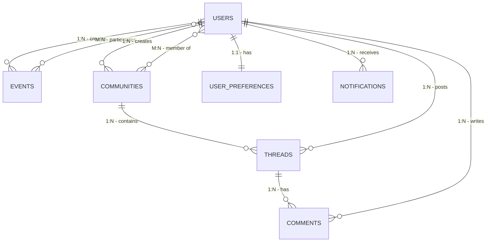

# NgumpulYuk - ERD Visual Diagram

## Entity Relationship Diagram (Visual)



---

## Simplified ERD (Core Relationships)



---

## Database Relationship Types Summary

### One-to-Many (1:N)

- 1 User → Many Events (created)
- 1 User → Many Communities (created)
- 1 User → Many Threads
- 1 User → Many Comments
- 1 User → Many Notifications
- 1 Community → Many Threads
- 1 Thread → Many Comments
- 1 Event → Many Participants
- 1 Event → Many Tags

### Many-to-Many (M:N)

- Users ↔ Events (through EVENT_PARTICIPANTS)
- Users ↔ Communities (through COMMUNITY_MEMBERS)
- Users ↔ Threads/Comments (through LIKES)

### One-to-One (1:1)

- User ↔ User_Preferences

---

## Key Junction Tables

### EVENT_PARTICIPANTS

**Purpose**: Connect users with events they join  
**Key Fields**: event_id, user_id, status, joined_at  
**Composite Unique**: (event_id, user_id)

### COMMUNITY_MEMBERS

**Purpose**: Connect users with communities they join  
**Key Fields**: community_id, user_id, role  
**Composite Unique**: (community_id, user_id)

### LIKES

**Purpose**: Track likes on threads and comments (polymorphic)  
**Key Fields**: user_id, likeable_type, likeable_id  
**Composite Unique**: (user_id, likeable_type, likeable_id)

---

## Database Normalization Level

**Current Design**: 3NF (Third Normal Form)

✅ **1NF**: All attributes contain atomic values  
✅ **2NF**: No partial dependencies  
✅ **3NF**: No transitive dependencies

**Benefits**:

- Eliminates data redundancy
- Ensures data integrity
- Optimized for read/write operations
- Scalable for future features

---

## Cardinality Summary

```
Users (1) ────────── (N) Events
Users (1) ────────── (N) Communities
Users (N) ─┐    ┌─ (N) Events
           └─(M)─┘
         EVENT_PARTICIPANTS

Users (N) ─┐    ┌─ (N) Communities
           └─(M)─┘
       COMMUNITY_MEMBERS

Communities (1) ── (N) Threads
Threads (1) ─────── (N) Comments
Users (1) ────────── (N) Threads
Users (1) ────────── (N) Comments
Users (1) ────────── (1) User_Preferences
```

---

## Implementation Notes

### PostgreSQL Recommended

- Native UUID support
- JSON/JSONB for flexible fields
- Full-text search capabilities
- Strong ACID compliance
- Excellent performance with indexes

### Supabase Integration

All tables can be created in Supabase with:

- Row Level Security (RLS) policies
- Real-time subscriptions
- Auto-generated REST API
- Built-in authentication integration

### Example RLS Policies

```sql
-- Users can only read their own data
CREATE POLICY "Users can view own profile"
ON users FOR SELECT
USING (auth.uid() = id);

-- Users can join public events
CREATE POLICY "Users can join events"
ON event_participants FOR INSERT
WITH CHECK (auth.uid() = user_id);

-- Only event creators can update events
CREATE POLICY "Creators can update events"
ON events FOR UPDATE
USING (auth.uid() = creator_id);
```

---

**Diagram Generated**: April 2026  
**For**: NgumpulYuk Platform  
**Database**: PostgreSQL / Supabase
